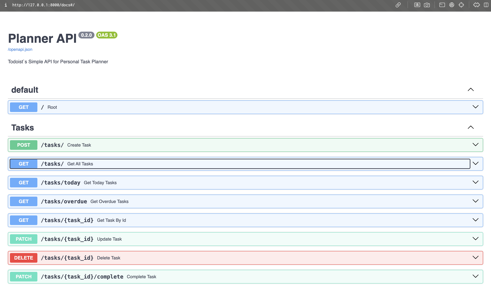

# Planner API

Simple CRUD API pet-project for managing tasks and deadlines

## About project

The project is written in FastAPI using Pydantic and SQLAlchemy.
It allows you to create and modify tasks, storing them in a PostgreSQL database.
The project is packaged in Docker and can be launched with a single command.

## Funcs

- create a task
- get all tasks
- get task by id
- update task
- delete task
- mark task as completed
- get tasks for today
- get overdue tasks
- filter tasks by status
- filter tasks by category

## Tech stack

- Python 3
- FastAPI
- SQLAlchemy
- PostgreSQL
- Docker
- Docker Compose

## Preview

